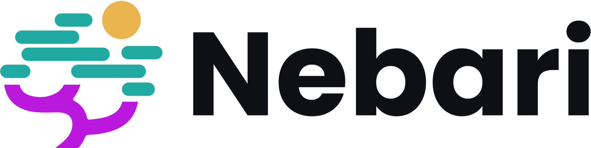
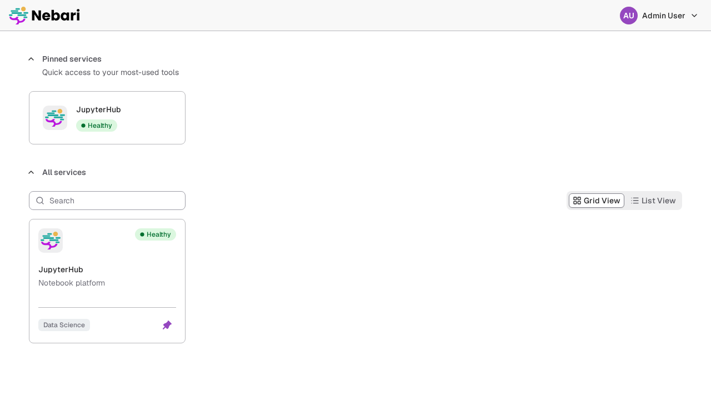
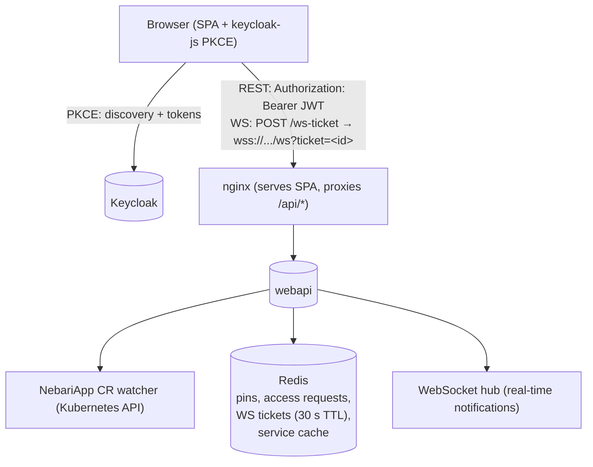

<p align="center">
  <a href="https://nebari.dev">
    <picture>
      <source media="(prefers-color-scheme: dark)" srcset="https://raw.githubusercontent.com/nebari-dev/nebari-design/main/logo-mark/horizontal/standard/Nebari-Logo-Horizontal-Lockup-White-text.png">
      <source media="(prefers-color-scheme: light)" srcset="https://raw.githubusercontent.com/nebari-dev/nebari-design/main/logo-mark/horizontal/standard/Nebari-Logo-Horizontal-Lockup.png">
      
    </picture>
  </a>
</p>

<h1 align="center">Nebari Landing</h1>

<p align="center">
  <strong>The Launchpad for Nebari — service discovery and access portal.</strong><br /> A real-time, SSO-aware landing
  page that gives users one place to find and launch every service on the platform.
</p>

<p align="center">
  <picture>
    <source media="(prefers-color-scheme: dark)" srcset="docs/static/screenshots/homepage-dark.png">
    <source media="(prefers-color-scheme: light)" srcset="docs/static/screenshots/homepage-light.png">
    
  </picture>
</p>

<p align="center">
  <a href="https://github.com/nebari-dev/nebari-landing/actions/workflows/webapi.yml"></a> <a
  href="https://github.com/nebari-dev/nebari-landing/actions/workflows/frontend.yml"></a> <a
  href="https://github.com/nebari-dev/nebari-landing/blob/main/LICENSE"></a> <a
  href="https://github.com/nebari-dev/nebari-landing/releases/latest"></a> <a href="https://golang.org"></a> <a
  href="https://react.dev"></a>
</p>

<p align="center">
  <a href="#architecture">Architecture</a> &middot; <a href="#quick-start">Quick Start</a> &middot; <a
  href="#helm-install">Helm Install</a> &middot; <a href="#development">Development</a> &middot; <a
  href="docs/api.md">API Reference</a> &middot; <a href="dev/QUICKSTART.md">Local Dev Guide</a> &middot; <a
  href="CONTRIBUTING.md">Contributing</a>
</p>


> **Status**: Under active development as part of Nebari Infrastructure Core (NIC). APIs and behavior may change without
> notice.

## What is Nebari Landing?

Nebari Landing is the **Launchpad** — the entry point for every NIC-managed cluster. It surfaces all deployed
`NebariApp` services in a single, authenticated UI so users can discover and launch platform tools without knowing
individual URLs.

It is deployed automatically by the [Nebari Infrastructure Core](https://github.com/nebari-dev/nebari-infrastructure-core)
as part of NIC's foundational software layer, and reconciled by the
[Nebari Operator](https://github.com/nebari-dev/nebari-operator) — the controller that orchestrates routing, TLS, and
OIDC client provisioning for every `NebariApp` on the cluster. Two components work together:

- **webapi** — Go REST API + WebSocket hub that watches `NebariApp` CRs via the Kubernetes API, validates JWTs from
  Keycloak, manages service pins, access requests, and real-time notifications over WebSocket.
- **frontend** — Vite/React SPA (shadcn/ui + Tailwind) served by nginx. The browser authenticates directly with
  Keycloak via [keycloak-js](https://www.keycloak.org/securing-apps/javascript-adapter) using PKCE; there is no
  server-side session and no proxy in front of the SPA.

## Architecture



Browsers cannot set an `Authorization` header on a WebSocket upgrade request, so the SPA exchanges its Bearer JWT for
a short-lived single-use ticket and passes it as `?ticket=<id>` on the upgrade. Non-browser clients can skip the
exchange and send the Bearer token directly. See [`docs/api.md`](docs/api.md#websocket-authentication) for the full
flow.

Both pods are deployed via the `charts/nebari-landing` Helm chart, typically managed by ArgoCD through NIC.

Release artifacts — the Go webapi binary (linux/darwin, amd64/arm64) and the packaged Helm chart — are attached to every
[GitHub release](https://github.com/nebari-dev/nebari-landing/releases) via GoReleaser.

## Key Features

| Feature | Description |
| --- | --- |
| **Service Discovery** | Automatically surfaces every `NebariApp` on the cluster — no manual registration required |
| **Real-time Updates** | WebSocket hub pushes service changes and notifications to the browser instantly |
| **SSO-Aware** | keycloak-js PKCE in the browser, JWT validation by the webapi — users land authenticated, admins see admin controls |
| **Pins & Access Requests** | Users can pin favourite services and request access to restricted ones |
| **shadcn/ui + Tailwind** | Accessible UI primitives with theme tokens; no design-system runtime to ship |
| **Runtime Branding** | Custom title, logo, favicon, CSS theme tokens, and classification banners — no image rebuild required |

## Branding & Theming

The frontend reads `/config.json` at startup (rendered from `values.yaml` by the Helm chart) and applies branding
settings to the document before React mounts. No image rebuild is needed — change `values.yaml` and redeploy.

### Available settings

| Field | Type | Description |
| --- | --- | --- |
| `frontend.branding.title` | string | Browser tab title (default: `"Nebari \| Launchpad"`) |
| `frontend.branding.logoUrl` | string | URL to a custom header logo image |
| `frontend.branding.logoUrlDark` | string | URL to a custom dark-mode header logo. Falls back to `logoUrl`, then the built-in logo, when empty |
| `frontend.branding.faviconUrl` | string | URL to a custom favicon |
| `frontend.branding.theme.light` | map | CSS variable overrides for light mode |
| `frontend.branding.theme.dark` | map | CSS variable overrides for dark mode |
| `frontend.branding.banners.top` | map | Classification banner pinned above the header (see below) |
| `frontend.branding.banners.bottom` | map | Classification banner pinned below the page content (see below) |

### Supported theme tokens

The `theme.light` and `theme.dark` maps accept any combination of these token names (camelCase):

`primary` · `primaryForeground` · `background` · `foreground` · `secondary` · `secondaryForeground` · `muted` · `mutedForeground` · `accent` · `accentForeground` · `border` · `ring` · `radius`

Each token maps to a CSS custom property on `:root` (light) or `.dark` (dark). For example, `primary: "#0066cc"`
becomes `--primary: #0066cc;`.

### Classification banners

Deployments in regulated or government environments often require a persistent classification banner (e.g.
[CUI](https://www.archives.gov/cui)) pinned to the top and bottom of every page. The `banners.top` and
`banners.bottom` maps each accept:

| Key | Type | Description |
| --- | --- | --- |
| `text` | string | Banner text, rendered as plain text (HTML is never interpreted). A banner is disabled while its `text` is empty — the default — so standard deployments show no banner and no layout shift |
| `background` | string | Optional CSS background color. Defaults to the theme foreground color, which follows light/dark mode |
| `foreground` | string | Optional CSS text color. Defaults to the theme background color, which follows light/dark mode |

```yaml
frontend:
  branding:
    banners:
      top:
        text: "CUI"
        background: "#502b85"
        foreground: "#ffffff"
      bottom:
        text: "CUI"
        background: "#502b85"
        foreground: "#ffffff"
```

The exact text and colors mandated for your environment are policy-specific — this chart provides the mechanism;
operators supply values per their compliance requirements. Banners are deployment-global (the same on every page)
and non-interactive.

### Example

```yaml
frontend:
  branding:
    title: "My Platform"
    logoUrl: "https://example.com/logo.png"
    logoUrlDark: "https://example.com/logo-dark.png"
    faviconUrl: "https://example.com/favicon.ico"
    theme:
      light:
        primary: "#0066cc"
        primaryForeground: "#ffffff"
        radius: "0.25rem"
      dark:
        primary: "#4da6ff"
        primaryForeground: "#000000"
```

> **Security note:** Theme token and banner color values are validated at runtime. Values containing CSS injection
> vectors (`;`, `{`, `}`, `url()`, `expression()`, `javascript:`, etc.) are silently dropped.

## Helm Install

> **Note**: In a full Nebari / NIC deployment the chart is managed by the Nebari Operator and ArgoCD — you do not need
> to install it manually.

### Add the Helm repository

```sh
helm repo add nebari https://nebari-dev.github.io/helm-repository
helm repo update
```

### Install

```sh
helm upgrade --install nebari-landing nebari/nebari-landing \
  --namespace nebari-system --create-namespace \
  --set frontend.keycloak.url=https://<keycloak-host> \
  --set frontend.keycloak.realm=<realm> \
  --set webapi.keycloak.url=http://keycloak-keycloakx-http.keycloak.svc.cluster.local:8080 \
  --set webapi.keycloak.realm=<realm> \
  --set webapi.keycloak.issuerUrl=https://<keycloak-host>
```

`frontend.keycloak.url` is the public Keycloak base URL the browser uses for PKCE redirects (Keycloak 17+ does not
have an `/auth` context root). `webapi.keycloak.url` is the in-cluster URL the webapi uses to fetch JWKS; the
`issuerUrl` is what the webapi validates the `iss` claim against and must match what the browser sees.

See [`charts/nebari-landing/values.yaml`](charts/nebari-landing/values.yaml) for the full set of configurable values.


## Quick Start

### Prerequisites

| Tool | Minimum version | Notes |
| --- | --- | --- |
| `docker` | 24+ | Used as the minikube driver |
| `kubectl` | 1.28+ | Cluster interaction |
| `helm` | 3.14+ | Installs Keycloak and PostgreSQL |
| `minikube` | any | Auto-downloaded to `.bin/` if absent |
| `node` | 22+ | Frontend development only (see `frontend/.node-version`) |
| `python3` | 3.10+ | Integration test script only |

See [dev/QUICKSTART.md](dev/QUICKSTART.md) for the full local dev walkthrough.

### Initial setup

```sh
# Setup the project
make -f dev/Makefile setup
```

### Start the local dev cluster

```sh
# Restart an existing cluster (after minikube was stopped or the host rebooted)
make -f dev/Makefile cluster-start
make -f dev/Makefile port-forward

# Tear down the deployed app (keeps the cluster running)
make -f dev/Makefile uninstall

# Or delete the cluster entirely
make -f dev/Makefile cluster-delete
```

### Front end development

```sh
# Start dev-watch: Vite serves the SPA with hot-reload, proxied through the
# in-cluster nginx so /api/* calls reach the real webapi.
make -f dev/Makefile dev-watch

# Stop dev-watch. Run this before deploying a manually-built frontend image,
# otherwise the watcher will keep overwriting the deployed bundle.
make -f dev/Makefile stop-dev-watch
```

### Build and run the webapi

```sh
# Build the binary
make build

# Run unit tests
make test

# Port-forward a running webapi deployment
make pf
```

### Helm chart targets

```sh
# Package the chart into dist/ (useful for local linting; not the release path)
make helm-package
```

> Releases are produced by the [Release prep](.github/workflows/release-prep.yaml)
> workflow — see [docs/maintainers/release-checklist.md](docs/maintainers/release-checklist.md).
> There are no local `make` targets for cutting a release.

### Run the frontend in watch mode

```sh
cd frontend
npm ci
npm run dev
```

> **Note**: `npm run dev` serves the SPA at `http://localhost:5173` but does **not** proxy `/api/*` calls — those
> require a running webapi. For a fully connected local dev loop (Keycloak + webapi + frontend with hot-reload) use the
> dev cluster described in [dev/QUICKSTART.md](dev/QUICKSTART.md).

> **Frontend-only path**: if you're iterating on the SPA and don't need the operator or webapi, use the lighter
> docker-compose + MSW workflow in [docs/dev-quickstart.md](docs/dev-quickstart.md) — real Keycloak login, mocked
> `/api/v1/*` driven by the OpenAPI spec, ~10-second boot.

## Development

### Project structure

- `cmd/` — webapi entry point (`main.go`).
- `internal/` — webapi packages:
  - `accessrequests/` — Access request store.
  - `api/` — HTTP handlers and routes.
  - `app/` — Internal domain model for service discovery (`App`, `LandingPage`, `HealthCheck`); decoupled from the Kubernetes API types.
  - `auth/` — JWT validation.
  - `cache/` — Service cache (backed by Redis).
  - `health/` — Health check endpoint.
  - `keycloak/` — Keycloak client.
  - `notifications/` — Notification store.
  - `pins/` — Pin store.
  - `watcher/` — NebariApp CR watcher.
  - `websocket/` — WebSocket hub.
  - `wsticket/` — Single-use WebSocket ticket store (Redis-backed).
- `frontend/src/` — Vite/React SPA:
  - `api/` — Typed API clients.
  - `app/` — App shell and global CSS (Tailwind + theme tokens).
  - `auth/` — Keycloak integration (keycloak-js PKCE).
  - `components/` — UI components.
- `charts/nebari-landing/` — Helm chart.
- `dev/` — Local dev environment (minikube + Keycloak).
- `docs/`:
  - `api.md` — HTTP API reference (auto-generated).
  - `design/` — Architecture and design documents.
  - `maintainers/` — Release checklist and maintainer guides.
  - `static/imgs/` — Screenshots and static assets.
- `test/e2e/` — End-to-end tests (Ginkgo).
- `cmd/gendocs/` — Injects auto-generated sections into `docs/api.md`.
- `cmd/genapicard/` — Renders `docs/assets/api-{dark,light}.svg` endpoint cards.

### Running tests

```sh
# Unit tests with coverage
make test

# HTML coverage report
make test-html

# End-to-end tests (requires a live cluster with CRDs installed)
make test-e2e
```

### API Reference

See [docs/api.md](docs/api.md) for the full HTTP API reference (auto-generated
endpoint table, per-route detail, and a dark/light SVG card preview at the top).

The webapi can also serve its OpenAPI 3.1 spec and a server-rendered HTML
reference at runtime when started with `--enable-docs` (env:
`ENABLE_DOCS=true`, chart value: `webapi.docsEnabled=true`). The viewer is a
single self-contained page (no JavaScript, no CDN) rendered from the embedded
spec at startup. Both routes are absent without the flag — never enable in
production:

```sh
./bin/webapi --enable-docs ...
# Spec:   curl http://localhost:8080/api/v1/docs/openapi.json
# Viewer: open http://localhost:8080/api/v1/docs
```

To regenerate the spec, the SVG cards, and `docs/api.md` after editing
handler annotations:

```sh
make docs
```

### Code quality

```sh
make fmt   # go fmt
make vet   # go vet
```

### Local GoReleaser snapshot

To test the full binary build locally before tagging:

```sh
goreleaser release --snapshot --clean
# Artifacts land in dist/
```

## Contributing

Contributions are welcome! To get started:

```sh
git clone https://github.com/nebari-dev/nebari-landing.git
cd nebari-landing

# Build the webapi binary
make build

# Run unit tests
make test

# Start the local dev environment (full minikube + Keycloak + webapi + frontend bootstrap)
make -f dev/Makefile setup
```

**Documentation**:
- **[Contributing Guide](CONTRIBUTING.md)** - Complete development workflow
- **[Release Checklist](docs/maintainers/release-checklist.md)** - For maintainers creating releases
- **[API Reference](docs/api.md)** - WebAPI endpoint documentation

See our [issue tracker](https://github.com/nebari-dev/nebari-landing/issues) for open issues.

## License

Apache License 2.0 — see [LICENSE](LICENSE) for details.
