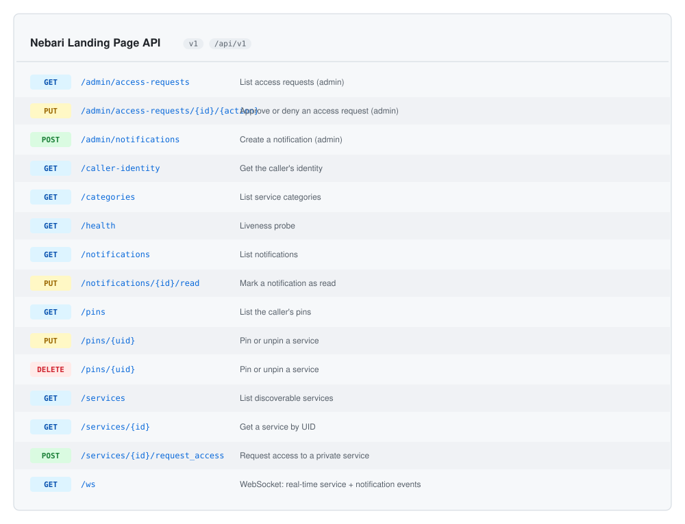

# REST API Reference

> Auto-generated by `go run ./cmd/gendocs` (or `make docs`). Do not edit by hand.

<!-- gendocs:apicard -->
<picture>
  <source media="(prefers-color-scheme: dark)"  srcset="assets/api-dark.svg">
  <source media="(prefers-color-scheme: light)" srcset="assets/api-light.svg">
  
</picture>
<!-- /gendocs:apicard -->

The webapi serves the routes below at the address chosen by `--port`
(default `:8080`). When started with `--enable-docs` it additionally exposes
the raw OpenAPI 3.1 spec at `/api/v1/docs/openapi.json` and a server-rendered
HTML reference at `/api/v1/docs` (no JavaScript, no CDN). Both routes are
absent in production.

```sh
./bin/webapi --enable-docs ...
# Spec:   curl http://localhost:8080/api/v1/docs/openapi.json
# Viewer: open http://localhost:8080/api/v1/docs
```

Endpoints requiring authentication accept a Keycloak-issued JWT in the
`Authorization` header:

```
Authorization: Bearer <token>
```

---

<!-- gendocs:api -->
## Endpoints

| Method | Path | Summary |
|--------|------|---------|
| `GET` | [`/admin/access-requests`](#get-adminaccess-requests) | List access requests (admin) |
| `PUT` | [`/admin/access-requests/{id}/{action}`](#put-adminaccess-requestsidaction) | Approve or deny an access request (admin) |
| `POST` | [`/admin/notifications`](#post-adminnotifications) | Create a notification (admin) |
| `GET` | [`/caller-identity`](#get-caller-identity) | Get the caller's identity |
| `GET` | [`/categories`](#get-categories) | List service categories |
| `GET` | [`/health`](#get-health) | Liveness probe |
| `GET` | [`/notifications`](#get-notifications) | List notifications |
| `PUT` | [`/notifications/{id}/read`](#put-notificationsidread) | Mark a notification as read |
| `GET` | [`/pins`](#get-pins) | List the caller's pins |
| `PUT` | [`/pins/{uid}`](#put-pinsuid) | Pin or unpin a service |
| `DELETE` | [`/pins/{uid}`](#delete-pinsuid) | Pin or unpin a service |
| `GET` | [`/services`](#get-services) | List discoverable services |
| `GET` | [`/services/{id}`](#get-servicesid) | Get a service by UID |
| `POST` | [`/services/{id}/request_access`](#post-servicesidrequest_access) | Request access to a private service |
| `GET` | [`/ws`](#get-ws) | WebSocket: real-time service + notification events |

---

### <a name="get-adminaccess-requests"></a>`GET /admin/access-requests`

List access requests (admin)

Returns access requests across the cluster. Admin-only — caller's JWT must include the configured admin group.

```sh
curl -s -X GET http://localhost:8080/api/v1/admin/access-requests \
  -H 'Authorization: Bearer $TOKEN'
```

---

### <a name="put-adminaccess-requestsidaction"></a>`PUT /admin/access-requests/{id}/{action}`

Approve or deny an access request (admin)

Action is encoded in the URL: PUT .../{id}/approve or .../{id}/deny. Approving also adds the user to the service's required Keycloak groups when a Keycloak admin client is configured.

```sh
curl -s -X PUT http://localhost:8080/api/v1/admin/access-requests/{id}/{action} \
  -H 'Authorization: Bearer $TOKEN' \
  -H 'Content-Type: application/json' \
  -d '{}'
```

---

### <a name="post-adminnotifications"></a>`POST /admin/notifications`

Create a notification (admin)

Creates a new platform-wide notification visible to all users via GET /notifications. Admin-only.

```sh
curl -s -X POST http://localhost:8080/api/v1/admin/notifications \
  -H 'Authorization: Bearer $TOKEN' \
  -H 'Content-Type: application/json' \
  -d '{}'
```

---

### <a name="get-caller-identity"></a>`GET /caller-identity`

Get the caller's identity

Echoes the resolved JWT claims for the caller. Returns {"authenticated": false} when no valid token is present.

```sh
curl -s -X GET http://localhost:8080/api/v1/caller-identity \
  -H 'Authorization: Bearer $TOKEN'
```

---

### <a name="get-categories"></a>`GET /categories`

List service categories

Returns the distinct set of category labels currently advertised by services in the cache. Public — no auth required.

```sh
curl -s -X GET http://localhost:8080/api/v1/categories
```

---

### <a name="get-health"></a>`GET /health`

Liveness probe

Returns {"status":"healthy"} as long as the server is up. Does not check downstream dependencies.

```sh
curl -s -X GET http://localhost:8080/api/v1/health
```

---

### <a name="get-notifications"></a>`GET /notifications`

List notifications

Returns all platform notifications. When the caller is authenticated, each item's "read" flag reflects that user's per-notification read state; for anonymous callers all items are reported as unread.

```sh
curl -s -X GET http://localhost:8080/api/v1/notifications \
  -H 'Authorization: Bearer $TOKEN'
```

---

### <a name="put-notificationsidread"></a>`PUT /notifications/{id}/read`

Mark a notification as read

Marks the specified notification as read for the calling user. Idempotent — returns 204 even if already read.

```sh
curl -s -X PUT http://localhost:8080/api/v1/notifications/{id}/read \
  -H 'Authorization: Bearer $TOKEN' \
  -H 'Content-Type: application/json' \
  -d '{}'
```

---

### <a name="get-pins"></a>`GET /pins`

List the caller's pins

Returns the caller's pinned services. UIDs is the raw stored list; Pins is the subset still resolvable in the live cache (so deleted services are gracefully filtered out).

```sh
curl -s -X GET http://localhost:8080/api/v1/pins \
  -H 'Authorization: Bearer $TOKEN'
```

---

### <a name="put-pinsuid"></a>`PUT /pins/{uid}`

Pin or unpin a service

PUT pins the service; DELETE unpins. Both operations are idempotent. The UID is the NebariApp UID exposed at status.serviceDiscovery.

```sh
curl -s -X PUT http://localhost:8080/api/v1/pins/{uid} \
  -H 'Authorization: Bearer $TOKEN' \
  -H 'Content-Type: application/json' \
  -d '{}'
```

---

### <a name="delete-pinsuid"></a>`DELETE /pins/{uid}`

Pin or unpin a service

PUT pins the service; DELETE unpins. Both operations are idempotent. The UID is the NebariApp UID exposed at status.serviceDiscovery.

```sh
curl -s -X DELETE http://localhost:8080/api/v1/pins/{uid} \
  -H 'Authorization: Bearer $TOKEN'
```

---

### <a name="get-services"></a>`GET /services`

List discoverable services

Returns the union of public services plus any private services the caller may access based on their JWT groups.
Anonymous callers see public services only; bearer-token callers additionally see private services they have access to. The "pinned" flag reflects the caller's own pin list (always false for anonymous).

```sh
curl -s -X GET http://localhost:8080/api/v1/services \
  -H 'Authorization: Bearer $TOKEN'
```

---

### <a name="get-servicesid"></a>`GET /services/{id}`

Get a service by UID

Returns the service if the caller may access it. Anonymous callers may only fetch public services; private services require a JWT whose groups intersect the service's required groups.

```sh
curl -s -X GET http://localhost:8080/api/v1/services/{id} \
  -H 'Authorization: Bearer $TOKEN'
```

---

### <a name="post-servicesidrequest_access"></a>`POST /services/{id}/request_access`

Request access to a private service

Requires authentication. Creates a pending access request for the caller against the named service; an admin then approves or denies via /admin/access-requests/{id}/{approve|deny}.

```sh
curl -s -X POST http://localhost:8080/api/v1/services/{id}/request_access \
  -H 'Authorization: Bearer $TOKEN' \
  -H 'Content-Type: application/json' \
  -d '{}'
```

---

### <a name="get-ws"></a>`GET /ws`

WebSocket: real-time service + notification events

Upgrade to WebSocket. Server pushes JSON envelopes for service add/update/delete and new notifications. The same auth gate as protected REST endpoints applies before the upgrade is accepted.

```sh
curl -s -X GET http://localhost:8080/api/v1/ws \
  -H 'Authorization: Bearer $TOKEN'
```
<!-- /gendocs:api -->
