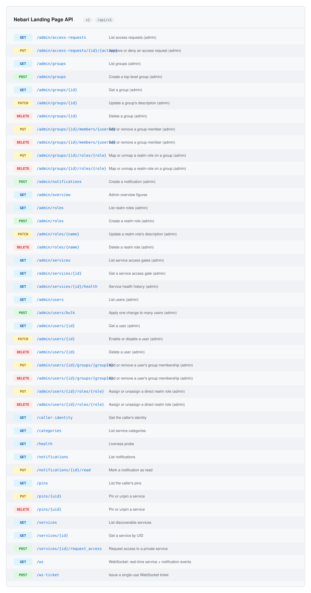

# REST API Reference

> Auto-generated by `go run ./cmd/gendocs` (or `make docs`). Do not edit by hand.

<!-- gendocs:apicard -->
<picture>
  <source media="(prefers-color-scheme: dark)"  srcset="assets/api-dark.svg">
  <source media="(prefers-color-scheme: light)" srcset="assets/api-light.svg">
  
</picture>
<!-- /gendocs:apicard -->

The webapi serves the routes below at the address chosen by `--port`
(default `:8080`). When started with `--enable-docs` it additionally exposes
the raw OpenAPI 3.1 spec at `/api/v1/docs/openapi.json` and a server-rendered
HTML reference at `/api/v1/docs` (no JavaScript, no CDN). Both routes are
absent in production.

```sh
./bin/webapi --enable-docs ...
# Spec:   curl http://localhost:8080/api/v1/docs/openapi.json
# Viewer: open http://localhost:8080/api/v1/docs
```

Endpoints requiring authentication accept a Keycloak-issued JWT in the
`Authorization` header:

```
Authorization: Bearer <token>
```

## WebSocket authentication

The `Authorization` header cannot be set on a WebSocket upgrade request
(the WS spec forbids it), so browsers cannot use the same Bearer-token path
the REST endpoints use. Instead, the SPA exchanges its Bearer JWT for a
short-lived single-use ticket and includes the ticket as a query parameter
on the upgrade request:

1. `POST /api/v1/ws-ticket` with `Authorization: Bearer <jwt>` returns
   `{"ticket": "<32-char hex>"}` with a ~30 s TTL.
2. `wss://<host>/api/v1/ws?ticket=<id>` upgrades to `101 Switching Protocols`.
   The webapi validates and atomically deletes the ticket via Redis `GETDEL`
   before accepting the upgrade.
3. Re-dialing the WS with the same ticket returns `401`. Tickets are single
   use.

The SPA's `useLaunchpadData` hook fetches a fresh ticket via its
`getQueryParams` callback on every connect (initial and auto-reconnect), so
each WS lifetime corresponds to exactly one redeemed ticket. On a fresh
page load it is normal to see two `/ws-ticket` POSTs: the first when the
hook mounts with no user, the second when `keycloak-js` resolves the user
and the WS client is rebuilt. After sign-in, steady state is one ticket
per WS connection.

Non-browser clients can skip the ticket exchange and send the Bearer token
directly on the upgrade. The `/ws` endpoint accepts either mechanism.

---

<!-- gendocs:api -->
## Endpoints

| Method | Path | Summary |
|--------|------|---------|
| `GET` | [`/admin/access-requests`](#get-adminaccess-requests) | List access requests (admin) |
| `PUT` | [`/admin/access-requests/{id}/{action}`](#put-adminaccess-requestsidaction) | Approve or deny an access request (admin) |
| `GET` | [`/admin/groups`](#get-admingroups) | List groups (admin) |
| `POST` | [`/admin/groups`](#post-admingroups) | Create a top-level group (admin) |
| `GET` | [`/admin/groups/{id}`](#get-admingroupsid) | Get a group (admin) |
| `PATCH` | [`/admin/groups/{id}`](#patch-admingroupsid) | Update a group's description (admin) |
| `DELETE` | [`/admin/groups/{id}`](#delete-admingroupsid) | Delete a group (admin) |
| `PUT` | [`/admin/groups/{id}/members/{userId}`](#put-admingroupsidmembersuserId) | Add or remove a group member (admin) |
| `DELETE` | [`/admin/groups/{id}/members/{userId}`](#delete-admingroupsidmembersuserId) | Add or remove a group member (admin) |
| `PUT` | [`/admin/groups/{id}/roles/{role}`](#put-admingroupsidrolesrole) | Map or unmap a realm role on a group (admin) |
| `DELETE` | [`/admin/groups/{id}/roles/{role}`](#delete-admingroupsidrolesrole) | Map or unmap a realm role on a group (admin) |
| `POST` | [`/admin/notifications`](#post-adminnotifications) | Create a notification (admin) |
| `GET` | [`/admin/overview`](#get-adminoverview) | Admin overview figures |
| `GET` | [`/admin/roles`](#get-adminroles) | List realm roles (admin) |
| `POST` | [`/admin/roles`](#post-adminroles) | Create a realm role (admin) |
| `PATCH` | [`/admin/roles/{name}`](#patch-adminrolesname) | Update a realm role's description (admin) |
| `DELETE` | [`/admin/roles/{name}`](#delete-adminrolesname) | Delete a realm role (admin) |
| `GET` | [`/admin/services`](#get-adminservices) | List service access gates (admin) |
| `GET` | [`/admin/services/{id}`](#get-adminservicesid) | Get a service access gate (admin) |
| `GET` | [`/admin/services/{id}/health`](#get-adminservicesidhealth) | Service health history (admin) |
| `GET` | [`/admin/users`](#get-adminusers) | List users (admin) |
| `POST` | [`/admin/users/bulk`](#post-adminusersbulk) | Apply one change to many users (admin) |
| `GET` | [`/admin/users/{id}`](#get-adminusersid) | Get a user (admin) |
| `PATCH` | [`/admin/users/{id}`](#patch-adminusersid) | Enable or disable a user (admin) |
| `DELETE` | [`/admin/users/{id}`](#delete-adminusersid) | Delete a user (admin) |
| `PUT` | [`/admin/users/{id}/groups/{groupId}`](#put-adminusersidgroupsgroupId) | Add or remove a user's group membership (admin) |
| `DELETE` | [`/admin/users/{id}/groups/{groupId}`](#delete-adminusersidgroupsgroupId) | Add or remove a user's group membership (admin) |
| `PUT` | [`/admin/users/{id}/roles/{role}`](#put-adminusersidrolesrole) | Assign or unassign a direct realm role (admin) |
| `DELETE` | [`/admin/users/{id}/roles/{role}`](#delete-adminusersidrolesrole) | Assign or unassign a direct realm role (admin) |
| `GET` | [`/caller-identity`](#get-caller-identity) | Get the caller's identity |
| `GET` | [`/categories`](#get-categories) | List service categories |
| `GET` | [`/health`](#get-health) | Liveness probe |
| `GET` | [`/notifications`](#get-notifications) | List notifications |
| `PUT` | [`/notifications/{id}/read`](#put-notificationsidread) | Mark a notification as read |
| `GET` | [`/pins`](#get-pins) | List the caller's pins |
| `PUT` | [`/pins/{uid}`](#put-pinsuid) | Pin or unpin a service |
| `DELETE` | [`/pins/{uid}`](#delete-pinsuid) | Pin or unpin a service |
| `GET` | [`/services`](#get-services) | List discoverable services |
| `GET` | [`/services/{id}`](#get-servicesid) | Get a service by UID |
| `POST` | [`/services/{id}/request_access`](#post-servicesidrequest_access) | Request access to a private service |
| `GET` | [`/ws`](#get-ws) | WebSocket: real-time service + notification events |
| `POST` | [`/ws-ticket`](#post-ws-ticket) | Issue a single-use WebSocket ticket |

---

### <a name="get-adminaccess-requests"></a>`GET /admin/access-requests`

List access requests (admin)

Returns access requests across the cluster. Admin-only — caller's JWT must include the configured admin group.

```sh
curl -s -X GET http://localhost:8080/api/v1/admin/access-requests \
  -H 'Authorization: Bearer $TOKEN'
```

---

### <a name="put-adminaccess-requestsidaction"></a>`PUT /admin/access-requests/{id}/{action}`

Approve or deny an access request (admin)

Action is encoded in the URL: PUT .../{id}/approve or .../{id}/deny. Approving also adds the user to the service's required Keycloak groups when a Keycloak admin client is configured.

```sh
curl -s -X PUT http://localhost:8080/api/v1/admin/access-requests/{id}/{action} \
  -H 'Authorization: Bearer $TOKEN' \
  -H 'Content-Type: application/json' \
  -d '{}'
```

---

### <a name="get-admingroups"></a>`GET /admin/groups`

List groups (admin)

```sh
curl -s -X GET http://localhost:8080/api/v1/admin/groups \
  -H 'Authorization: Bearer $TOKEN'
```

---

### <a name="post-admingroups"></a>`POST /admin/groups`

Create a top-level group (admin)

```sh
curl -s -X POST http://localhost:8080/api/v1/admin/groups \
  -H 'Authorization: Bearer $TOKEN' \
  -H 'Content-Type: application/json' \
  -d '{}'
```

---

### <a name="get-admingroupsid"></a>`GET /admin/groups/{id}`

Get a group (admin)

```sh
curl -s -X GET http://localhost:8080/api/v1/admin/groups/{id} \
  -H 'Authorization: Bearer $TOKEN'
```

---

### <a name="patch-admingroupsid"></a>`PATCH /admin/groups/{id}`

Update a group's description (admin)

```sh
curl -s -X PATCH http://localhost:8080/api/v1/admin/groups/{id} \
  -H 'Authorization: Bearer $TOKEN' \
  -H 'Content-Type: application/json' \
  -d '{}'
```

---

### <a name="delete-admingroupsid"></a>`DELETE /admin/groups/{id}`

Delete a group (admin)

Refused with 409 while any landing-page service lists the group under spec.auth.groups in its NebariApp; remove it from the CR first.

```sh
curl -s -X DELETE http://localhost:8080/api/v1/admin/groups/{id} \
  -H 'Authorization: Bearer $TOKEN'
```

---

### <a name="put-admingroupsidmembersuserId"></a>`PUT /admin/groups/{id}/members/{userId}`

Add or remove a group member (admin)

```sh
curl -s -X PUT http://localhost:8080/api/v1/admin/groups/{id}/members/{userId} \
  -H 'Authorization: Bearer $TOKEN' \
  -H 'Content-Type: application/json' \
  -d '{}'
```

---

### <a name="delete-admingroupsidmembersuserId"></a>`DELETE /admin/groups/{id}/members/{userId}`

Add or remove a group member (admin)

```sh
curl -s -X DELETE http://localhost:8080/api/v1/admin/groups/{id}/members/{userId} \
  -H 'Authorization: Bearer $TOKEN'
```

---

### <a name="put-admingroupsidrolesrole"></a>`PUT /admin/groups/{id}/roles/{role}`

Map or unmap a realm role on a group (admin)

```sh
curl -s -X PUT http://localhost:8080/api/v1/admin/groups/{id}/roles/{role} \
  -H 'Authorization: Bearer $TOKEN' \
  -H 'Content-Type: application/json' \
  -d '{}'
```

---

### <a name="delete-admingroupsidrolesrole"></a>`DELETE /admin/groups/{id}/roles/{role}`

Map or unmap a realm role on a group (admin)

```sh
curl -s -X DELETE http://localhost:8080/api/v1/admin/groups/{id}/roles/{role} \
  -H 'Authorization: Bearer $TOKEN'
```

---

### <a name="post-adminnotifications"></a>`POST /admin/notifications`

Create a notification (admin)

Creates a new platform-wide notification visible to all users via GET /notifications. Admin-only.

```sh
curl -s -X POST http://localhost:8080/api/v1/admin/notifications \
  -H 'Authorization: Bearer $TOKEN' \
  -H 'Content-Type: application/json' \
  -d '{}'
```

---

### <a name="get-adminoverview"></a>`GET /admin/overview`

Admin overview figures

Headline counts for the admin dashboard: accounts, groups, roles, service health and gates, access requests by status, and live Keycloak sessions. Figures that depend on an unavailable backend are zero and flagged via the *Available booleans. Admin-only.

```sh
curl -s -X GET http://localhost:8080/api/v1/admin/overview \
  -H 'Authorization: Bearer $TOKEN'
```

---

### <a name="get-adminroles"></a>`GET /admin/roles`

List realm roles (admin)

```sh
curl -s -X GET http://localhost:8080/api/v1/admin/roles \
  -H 'Authorization: Bearer $TOKEN'
```

---

### <a name="post-adminroles"></a>`POST /admin/roles`

Create a realm role (admin)

```sh
curl -s -X POST http://localhost:8080/api/v1/admin/roles \
  -H 'Authorization: Bearer $TOKEN' \
  -H 'Content-Type: application/json' \
  -d '{}'
```

---

### <a name="patch-adminrolesname"></a>`PATCH /admin/roles/{name}`

Update a realm role's description (admin)

```sh
curl -s -X PATCH http://localhost:8080/api/v1/admin/roles/{name} \
  -H 'Authorization: Bearer $TOKEN' \
  -H 'Content-Type: application/json' \
  -d '{}'
```

---

### <a name="delete-adminrolesname"></a>`DELETE /admin/roles/{name}`

Delete a realm role (admin)

```sh
curl -s -X DELETE http://localhost:8080/api/v1/admin/roles/{name} \
  -H 'Authorization: Bearer $TOKEN'
```

---

### <a name="get-adminservices"></a>`GET /admin/services`

List service access gates (admin)

Every landing-page service with the gate derived from its NebariApp spec.auth (visibility + requiredGroups). Read-only: the CR is the source of truth. Does not require a Keycloak admin client.

```sh
curl -s -X GET http://localhost:8080/api/v1/admin/services \
  -H 'Authorization: Bearer $TOKEN'
```

---

### <a name="get-adminservicesid"></a>`GET /admin/services/{id}`

Get a service access gate (admin)

```sh
curl -s -X GET http://localhost:8080/api/v1/admin/services/{id} \
  -H 'Authorization: Bearer $TOKEN'
```

---

### <a name="get-adminservicesidhealth"></a>`GET /admin/services/{id}/health`

Service health history (admin)

Latest probe outcome, uptime over the retained window, the current streak, and every retained sample (about 24h at the default probe interval; in-memory, reset on webapi restart).

```sh
curl -s -X GET http://localhost:8080/api/v1/admin/services/{id}/health \
  -H 'Authorization: Bearer $TOKEN'
```

---

### <a name="get-adminusers"></a>`GET /admin/users`

List users (admin)

Returns every realm user with direct group ids and realm roles. Optional filters: q (name/username/email substring), group (group id), role (realm role), enabled (true|false). Admin-only.

```sh
curl -s -X GET http://localhost:8080/api/v1/admin/users \
  -H 'Authorization: Bearer $TOKEN'
```

---

### <a name="post-adminusersbulk"></a>`POST /admin/users/bulk`

Apply one change to many users (admin)

Actions: addToGroup / removeFromGroup (need groupId), assignRole / unassignRole (need role), enable, disable. Users that fail are skipped and counted out of `updated`.

```sh
curl -s -X POST http://localhost:8080/api/v1/admin/users/bulk \
  -H 'Authorization: Bearer $TOKEN' \
  -H 'Content-Type: application/json' \
  -d '{}'
```

---

### <a name="get-adminusersid"></a>`GET /admin/users/{id}`

Get a user (admin)

```sh
curl -s -X GET http://localhost:8080/api/v1/admin/users/{id} \
  -H 'Authorization: Bearer $TOKEN'
```

---

### <a name="patch-adminusersid"></a>`PATCH /admin/users/{id}`

Enable or disable a user (admin)

```sh
curl -s -X PATCH http://localhost:8080/api/v1/admin/users/{id} \
  -H 'Authorization: Bearer $TOKEN' \
  -H 'Content-Type: application/json' \
  -d '{}'
```

---

### <a name="delete-adminusersid"></a>`DELETE /admin/users/{id}`

Delete a user (admin)

Permanently deletes the realm user together with their group memberships, role mappings and sessions. Admins cannot delete their own account.

```sh
curl -s -X DELETE http://localhost:8080/api/v1/admin/users/{id} \
  -H 'Authorization: Bearer $TOKEN'
```

---

### <a name="put-adminusersidgroupsgroupId"></a>`PUT /admin/users/{id}/groups/{groupId}`

Add or remove a user's group membership (admin)

PUT adds the user to the group; DELETE removes them. Both are idempotent.

```sh
curl -s -X PUT http://localhost:8080/api/v1/admin/users/{id}/groups/{groupId} \
  -H 'Authorization: Bearer $TOKEN' \
  -H 'Content-Type: application/json' \
  -d '{}'
```

---

### <a name="delete-adminusersidgroupsgroupId"></a>`DELETE /admin/users/{id}/groups/{groupId}`

Add or remove a user's group membership (admin)

PUT adds the user to the group; DELETE removes them. Both are idempotent.

```sh
curl -s -X DELETE http://localhost:8080/api/v1/admin/users/{id}/groups/{groupId} \
  -H 'Authorization: Bearer $TOKEN'
```

---

### <a name="put-adminusersidrolesrole"></a>`PUT /admin/users/{id}/roles/{role}`

Assign or unassign a direct realm role (admin)

```sh
curl -s -X PUT http://localhost:8080/api/v1/admin/users/{id}/roles/{role} \
  -H 'Authorization: Bearer $TOKEN' \
  -H 'Content-Type: application/json' \
  -d '{}'
```

---

### <a name="delete-adminusersidrolesrole"></a>`DELETE /admin/users/{id}/roles/{role}`

Assign or unassign a direct realm role (admin)

```sh
curl -s -X DELETE http://localhost:8080/api/v1/admin/users/{id}/roles/{role} \
  -H 'Authorization: Bearer $TOKEN'
```

---

### <a name="get-caller-identity"></a>`GET /caller-identity`

Get the caller's identity

Echoes the resolved JWT claims for the caller. Returns {"authenticated": false} when no valid token is present.

```sh
curl -s -X GET http://localhost:8080/api/v1/caller-identity \
  -H 'Authorization: Bearer $TOKEN'
```

---

### <a name="get-categories"></a>`GET /categories`

List service categories

Returns the distinct set of category labels currently advertised by services in the cache. Public — no auth required.

```sh
curl -s -X GET http://localhost:8080/api/v1/categories
```

---

### <a name="get-health"></a>`GET /health`

Liveness probe

Returns {"status":"healthy"} as long as the server is up. Does not check downstream dependencies.

```sh
curl -s -X GET http://localhost:8080/api/v1/health
```

---

### <a name="get-notifications"></a>`GET /notifications`

List notifications

Returns all platform notifications. When the caller is authenticated, each item's "read" flag reflects that user's per-notification read state; for anonymous callers all items are reported as unread.

```sh
curl -s -X GET http://localhost:8080/api/v1/notifications \
  -H 'Authorization: Bearer $TOKEN'
```

---

### <a name="put-notificationsidread"></a>`PUT /notifications/{id}/read`

Mark a notification as read

Marks the specified notification as read for the calling user. Idempotent — returns 204 even if already read.

```sh
curl -s -X PUT http://localhost:8080/api/v1/notifications/{id}/read \
  -H 'Authorization: Bearer $TOKEN' \
  -H 'Content-Type: application/json' \
  -d '{}'
```

---

### <a name="get-pins"></a>`GET /pins`

List the caller's pins

Returns the caller's pinned services. UIDs is the raw stored list; Pins is the subset still resolvable in the live cache (so deleted services are gracefully filtered out).

```sh
curl -s -X GET http://localhost:8080/api/v1/pins \
  -H 'Authorization: Bearer $TOKEN'
```

---

### <a name="put-pinsuid"></a>`PUT /pins/{uid}`

Pin or unpin a service

PUT pins the service; DELETE unpins. Both operations are idempotent. The UID is the NebariApp UID exposed at status.serviceDiscovery.

```sh
curl -s -X PUT http://localhost:8080/api/v1/pins/{uid} \
  -H 'Authorization: Bearer $TOKEN' \
  -H 'Content-Type: application/json' \
  -d '{}'
```

---

### <a name="delete-pinsuid"></a>`DELETE /pins/{uid}`

Pin or unpin a service

PUT pins the service; DELETE unpins. Both operations are idempotent. The UID is the NebariApp UID exposed at status.serviceDiscovery.

```sh
curl -s -X DELETE http://localhost:8080/api/v1/pins/{uid} \
  -H 'Authorization: Bearer $TOKEN'
```

---

### <a name="get-services"></a>`GET /services`

List discoverable services

Returns the union of public services plus any private services the caller may access based on their JWT groups.
Anonymous callers see public services only; bearer-token callers additionally see private services they have access to. The "pinned" flag reflects the caller's own pin list (always false for anonymous).

```sh
curl -s -X GET http://localhost:8080/api/v1/services \
  -H 'Authorization: Bearer $TOKEN'
```

---

### <a name="get-servicesid"></a>`GET /services/{id}`

Get a service by UID

Returns the service if the caller may access it. Anonymous callers may only fetch public services; private services require a JWT whose groups intersect the service's required groups.

```sh
curl -s -X GET http://localhost:8080/api/v1/services/{id} \
  -H 'Authorization: Bearer $TOKEN'
```

---

### <a name="post-servicesidrequest_access"></a>`POST /services/{id}/request_access`

Request access to a private service

Requires authentication. Creates a pending access request for the caller against the named service; an admin then approves or denies via /admin/access-requests/{id}/{approve|deny}.

```sh
curl -s -X POST http://localhost:8080/api/v1/services/{id}/request_access \
  -H 'Authorization: Bearer $TOKEN' \
  -H 'Content-Type: application/json' \
  -d '{}'
```

---

### <a name="get-ws"></a>`GET /ws`

WebSocket: real-time service + notification events

Upgrade to WebSocket. Server pushes JSON envelopes for service add/update/delete and new notifications. Auth is required before the upgrade: send `Authorization: Bearer <token>` or pass `?ticket=<id>` from POST /api/v1/ws-ticket (browsers must use the ticket path).

```sh
curl -s -X GET http://localhost:8080/api/v1/ws \
  -H 'Authorization: Bearer $TOKEN'
```

---

### <a name="post-ws-ticket"></a>`POST /ws-ticket`

Issue a single-use WebSocket ticket

Mints a short-lived (~30 s) single-use ticket the browser passes as `?ticket=<id>` on the WebSocket upgrade request, since the WS spec forbids sending an Authorization header on the upgrade. Requires a Bearer JWT.

```sh
curl -s -X POST http://localhost:8080/api/v1/ws-ticket \
  -H 'Authorization: Bearer $TOKEN' \
  -H 'Content-Type: application/json' \
  -d '{}'
```
<!-- /gendocs:api -->
