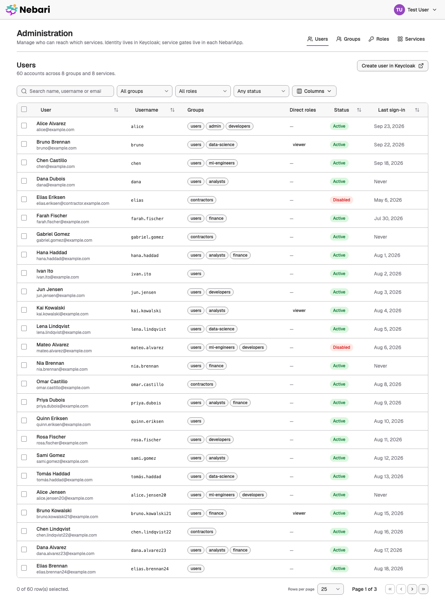
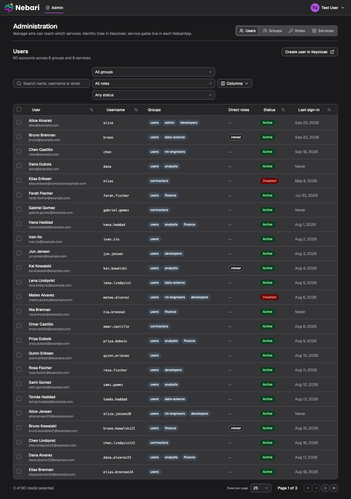
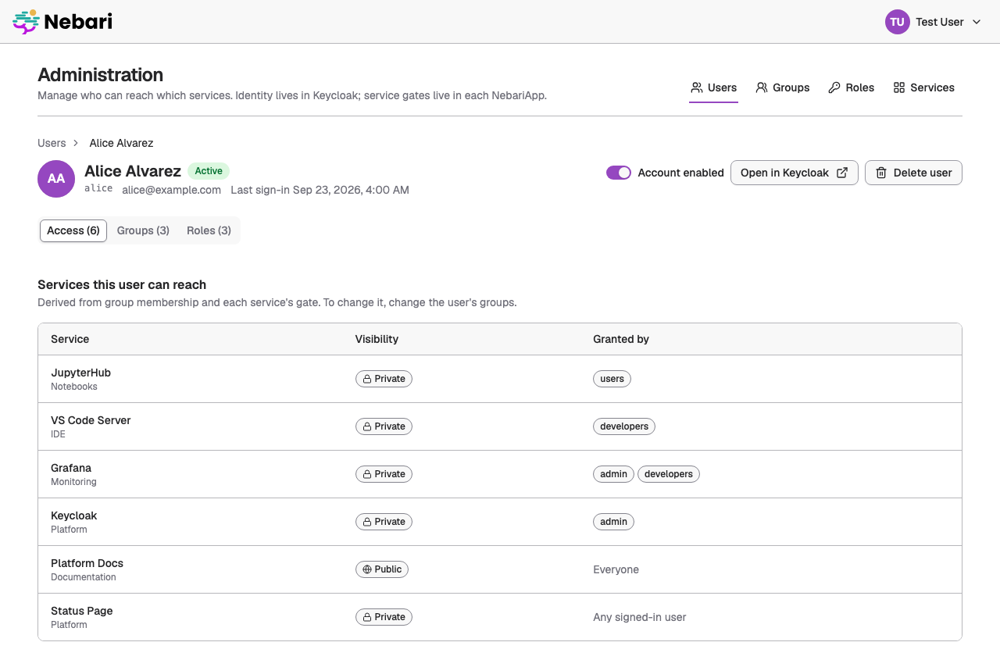
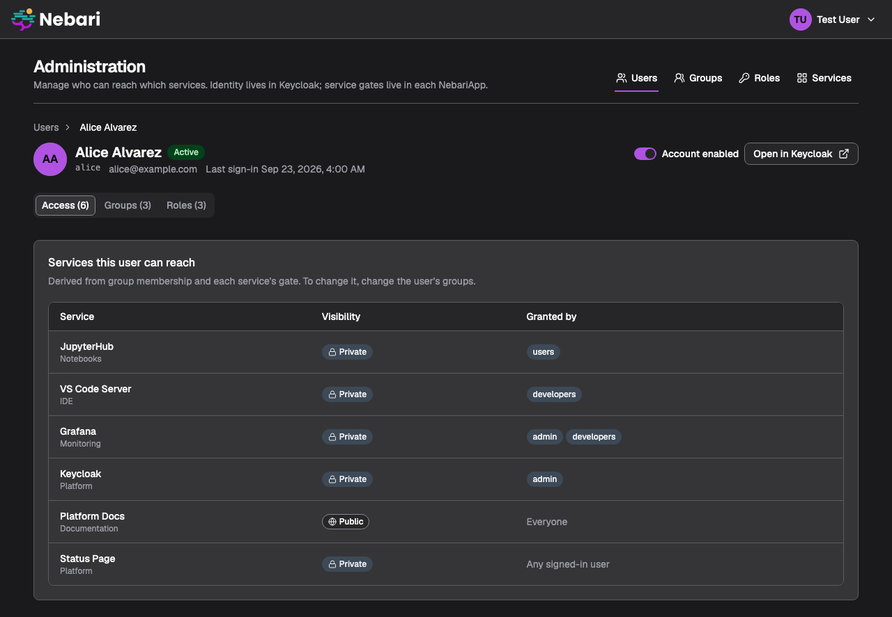
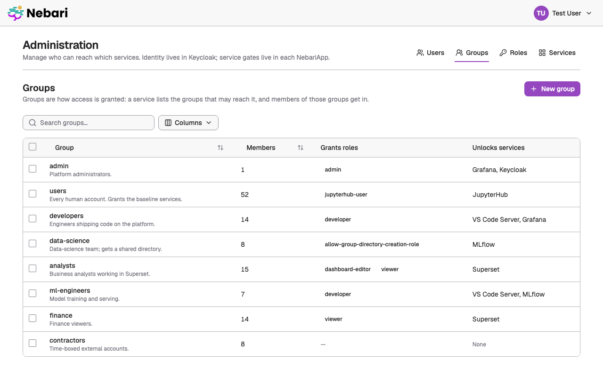
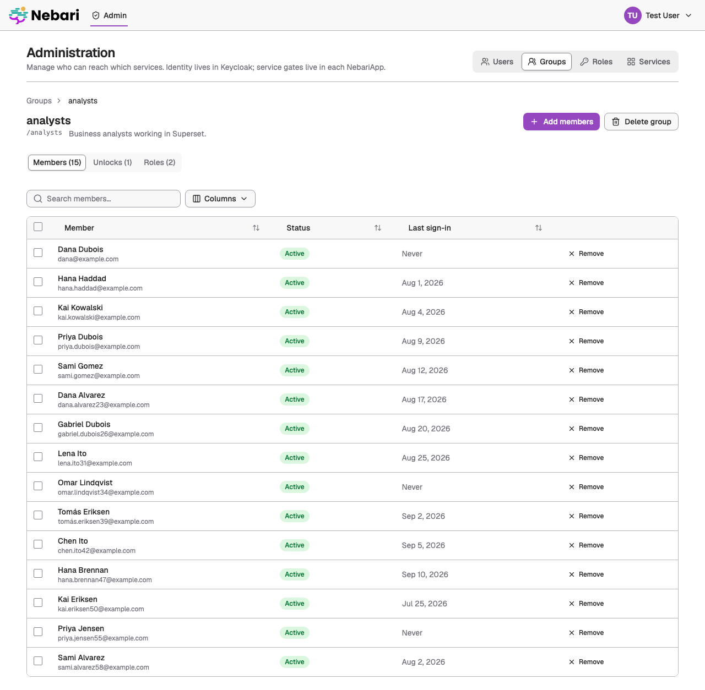
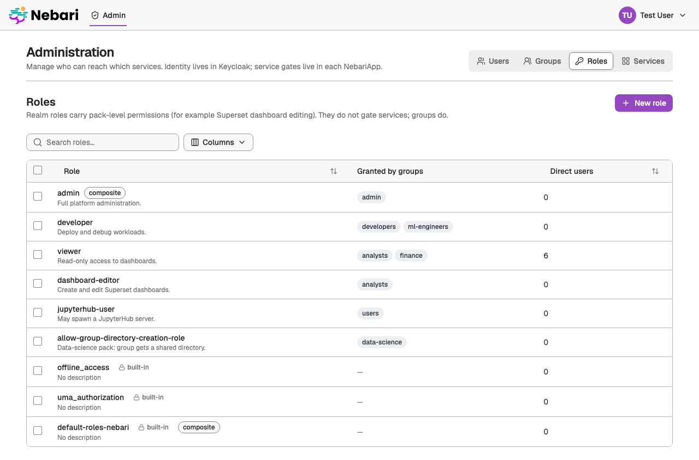
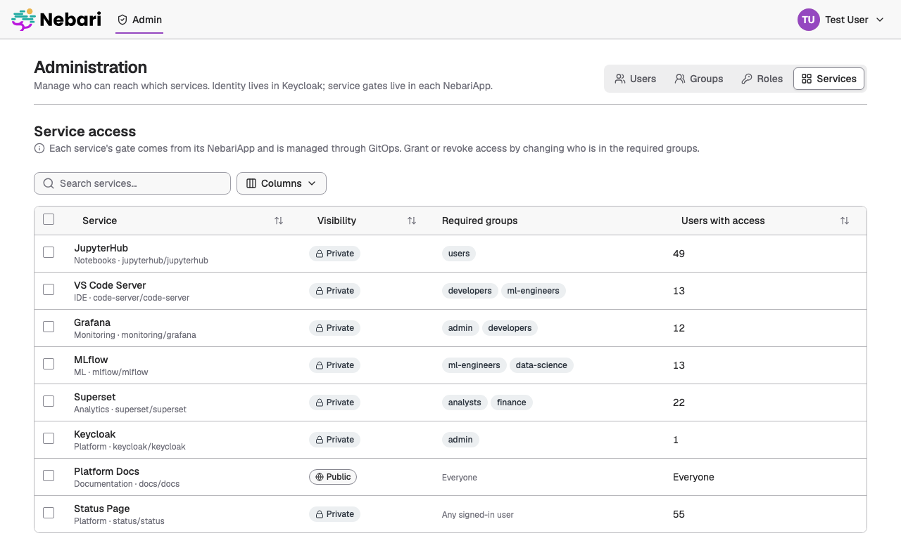
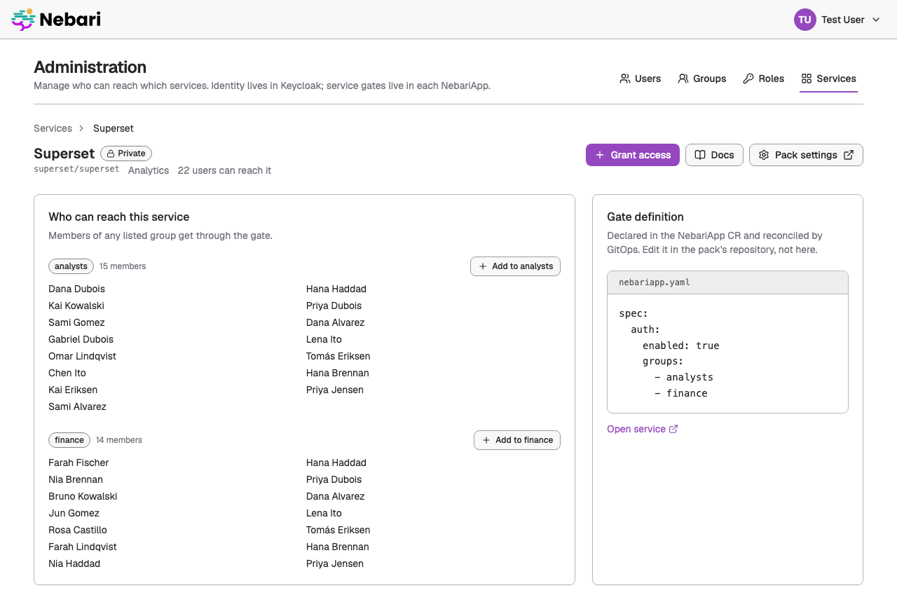

# Design: Admin / User Management (prototype)

**Status:** Prototype built (mock-backed) — **Issue:** [#208](https://github.com/nebari-dev/nebari-landing/issues/208)
**Branch:** `proto/admin-user-management` **Created:** 2026-09-28

This document is the plan behind the clickable prototype on the branch above.
The prototype is frontend-only and runs entirely against MSW mocks
(`VITE_USE_MOCKS=1`); no webapi changes ship with it. Its purpose is to make the
pain points concrete before we commit to real endpoints — see the discussion on
#208 ("even read-only at first pays dividends").

## Scope and guiding principles

The issue thread converged on three constraints that the prototype is built
around:

1. **Nebari core owns identity, packs own their internals.** Users, groups and
   realm roles live in Keycloak. The only access rule Nebari core owns is the
   routing gate on each `NebariApp` (`spec.auth.enabled` + `spec.auth.groups`,
   which the webapi exposes as `visibility` + `requiredGroups`). Pack-internal
   permission mappings (Superset
   roles, JupyterHub profiles, the DS-pack `allow-group-directory-creation-role`)
   are **out of scope** for a unified UI.
2. **Don't create a competing configuration path.** `spec.auth.groups` is
   declared in the CR and reconciled by GitOps. The UI therefore treats *service → groups*
   as **read-only** and explains where it comes from. Access is granted or
   revoked by changing **group membership** (Keycloak), never by editing the CR
   from the UI.
3. **Add value over the Keycloak console, don't re-skin it.** The differentiator
   is the *access lens*: "what can this user reach?", "who can reach this
   service?", and fast onboarding/offboarding through bulk group changes.
   Anything Keycloak already does well and we do not improve on links out to
   Keycloak instead.

Ken's "iOS Settings" idea is folded in as an extension point: a pack may
register two optional URLs on its `NebariApp` (`docsUrl`, `settingsUrl`) and the
service access view surfaces them as "Docs" / "Open pack settings" links. That
is the whole contract — packs do not inject UI.

## Information architecture

```
/admin                     → redirects to /admin/users
/admin/users               Users list (search, filters, bulk actions)
/admin/users/:id           User detail: profile · groups · roles · access
/admin/groups              Groups list (create)
/admin/groups/:id          Group detail: members · roles · services it unlocks
/admin/roles               Realm roles list (create)
/admin/roles/:name         Role detail: users · groups holding it
/admin/services            Service access map (read-only gate per service)
/admin/services/:id        Who can reach this service, and why
```

Every entity page answers the same two questions in both directions:

| From a…  | "Can access" column / panel                                              |
|----------|--------------------------------------------------------------------------|
| user     | services reachable via *any* of the user's groups (plus public services) |
| group    | services whose `requiredGroups` contains the group                       |
| role     | (informational) users and groups holding the role                        |
| service  | groups in `requiredGroups`, expanded to the users in them                |

The access computation is a pure client-side helper (`src/admin/lib/access.ts`)
that mirrors `canAccessPolicy` in `internal/api/handlers.go`, so the rule is
written once on each side and can be unit-tested.

## Role-based entry point

- The webapi already decides admin-ness by the JWT `groups` claim containing
  the configured admin group (`webapi.keycloak.adminGroup`, default `admin`).
  The SPA mirrors that through `GET /api/v1/caller-identity`, which returns the
  caller's groups and is the server-trusted source. A new `useCallerIdentity()`
  hook exposes `isAdmin`.
- Admins get an **Administration** item in the profile menu. The header nav
  stays untouched, so non-admins see exactly what they see today.
- `/admin/*` renders a "Not authorized" state for non-admins and a sign-in
  prompt for anonymous users; the routes never 404 for them, so deep links stay
  shareable.
- Group names from Keycloak may arrive as paths (`/admin`); the client
  normalises the leading slash before comparing.

## Screens

**Users list** — table (name, username, email, groups, roles, status, last
sign-in), debounced search, filters by group / role / status, row selection with
a sticky bulk-action bar (add to group, remove from group, assign role, enable,
disable). Paginated at 25 to exercise the scale state with ~60 seeded users.

**User detail** — header with avatar/status/enable toggle; tabs: *Groups*
(add via combobox, remove inline), *Roles* (direct vs inherited-from-group),
*Access* (services, each with the group that unlocks it). Actions: "Open in
Keycloak" link for anything we don't model.

**Groups list / detail** — cards or table with member count and unlocked
services; create/rename/delete via dialog (delete is blocked with an
explanation while the group is referenced by any service's `requiredGroups`).
Detail: members (bulk add via multi-select combobox), roles, services.

**Roles list / detail** — realm roles with description and composite flag;
create/edit/delete via dialog; assign to users or groups from the detail page.

**Service access map** — one row per `NebariApp` on the landing page:
visibility badge, required groups, effective user count. Detail page lists the
groups and their members, shows the YAML snippet of the gate with a "managed by
the NebariApp CR" note, and surfaces the pack's `docsUrl` / `settingsUrl`.

**Empty and scale states** — a shared `EmptyState` component for zero rows,
zero search results, and zero members; pagination and column truncation for
scale; skeletons while loading; toasts for mutation results.

**Theming** — everything uses semantic tokens from `@nebari/theme`, so light and
dark come for free; the e2e theme spec covers the new pages.

## API

All under `/api/v1/admin/`, admin-gated by the existing `isAdmin` check and
implemented in `internal/api/admin_identity.go` on top of the gocloak admin
client (`internal/keycloak/identity.go`). The endpoints answer 501 when no
Keycloak admin credentials are configured (`webapi.keycloak.adminSecretName`).
The MSW layer serves the same contract for the frontend-only dev loop.

| Method | Path | Notes |
|--------|------|-------|
| GET | `users?q=&group=&role=&enabled=&page=&pageSize=` | `{ users, total }` |
| GET / PATCH | `users/{id}` | PATCH body `{ enabled }` |
| PUT / DELETE | `users/{id}/groups/{groupId}` | membership |
| PUT / DELETE | `users/{id}/roles/{role}` | realm role mapping |
| POST | `users/bulk` | `{ userIds, action, groupId?, role? }` |
| GET / POST | `groups` | |
| GET / PATCH / DELETE | `groups/{id}` | DELETE 409 while referenced by a service |
| PUT / DELETE | `groups/{id}/members/{userId}` | |
| PUT / DELETE | `groups/{id}/roles/{role}` | |
| GET / POST | `roles` | |
| GET / PATCH / DELETE | `roles/{name}` | |
| GET | `services` | read-only; `{ id, name, displayName, category, namespace, visibility, requiredGroups, docsUrl?, settingsUrl? }` sourced from the watcher cache |

Frontend types live in `frontend/src/admin/api/types.ts`; the MSW handlers and
seed data live in `frontend/src/mocks/admin/`. Group descriptions are stored as
the Keycloak group attribute `description`; `lastSignInAt` is always null
until we read the Keycloak events store.

## Out of scope for the prototype

- The `docsUrl` / `settingsUrl` CRD fields (proposed, not implemented; the
  mock seed carries them so the UI shows the affordance).
- Client roles, composite-role editing, user creation and password flows
  (link to Keycloak).
- Pack-internal permission mappings.
- Audit log / history.

## Prototype status

Everything above is built on the branch: the frontend against the MSW seed,
and the webapi endpoints against Keycloak.

**Try it with mocks:** follow [`docs/dev-quickstart.md`](../dev-quickstart.md)
(docker compose Keycloak + `VITE_USE_MOCKS=1`), sign in as `admin` /
`password`, and open `/admin`. Sign in as `dev` to see the non-admin
experience.

**Try it for real:** `make -f dev/Makefile setup` (minikube + Keycloak +
operator + the chart), then open `http://localhost:8080/` and sign in as the
realm admin (see `dev/QUICKSTART.md`). The users, groups and roles shown are
the live `nebari` realm; the service gates come from the sample NebariApps.

**Screenshots** (captured by `tests/e2e/screenshots.spec.ts`, so they regenerate
with the rest):

| | |
|---|---|
|  |  |
|  |  |
|  |  |
|  |  |
|  | |

**Where the code lives**

| Path | What |
|---|---|
| `frontend/src/admin/` | The whole feature: `AdminApp.tsx` (gate + routes), `pages/`, `components/`, `api/`, `hooks/`, `lib/access.ts` |
| `frontend/src/hooks/useCallerIdentity.ts` | Server-trusted `isAdmin` |
| `frontend/src/mocks/admin/` | Seed data and MSW handlers for the proposed endpoints |
| `frontend/tests/e2e/admin.spec.ts` | Flows, non-admin gate, axe on three pages |
| `frontend/tests/unit/admin/access.test.ts` | The access rule |

**Things learned while building it**

- The Nebari `Button` defaults its render element to `<button type="button">`,
  and Base UI's render merge lets that win over a `type="submit"` prop. Submit
  buttons need `render={<button type="submit" />}`.
- Base UI toasts expose `role="dialog"`, so tests must name dialogs when
  asserting they closed.
- MSW handlers written with relative paths only match in Node when
  `getResponse` is given a `baseUrl`; the Playwright fixture passes the
  request origin.
- The `@nebari/theme` install appends the full primitive color ramps to
  `index.css`; harmless, but a large diff to be aware of on the first
  component install in any app.

**Not built** (see "Out of scope"): the `docsUrl` / `settingsUrl` CRD fields,
role editing beyond description, user creation, last sign-in from the
Keycloak events store.

## Open questions for review

- Should the admin group be configurable in `config.json` (mirroring
  `webapi.keycloak.adminGroup`) or should the SPA rely purely on
  `caller-identity`? The prototype does the latter and hard-codes the fallback
  name only for display.
- Is "grant access = add to group" clear enough, or do admins expect a
  "Grant" button on the service page that performs the group add under the
  hood? The prototype offers the latter as a shortcut that still only touches
  Keycloak.
- Do we want the users list to be Keycloak-paginated (server) or fully loaded
  and filtered client-side? The mock supports server paging; the UI works with
  either.
