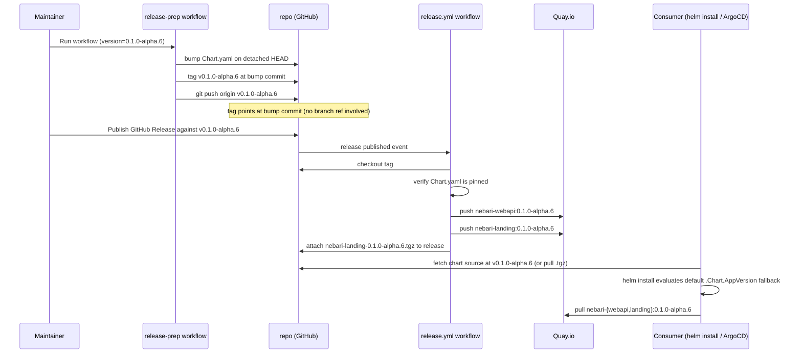

# Release Flow

How a `nebari-landing` release moves from a maintainer clicking a button in GitHub Actions to a Helm chart that resolves to a matching pair of container images. This is the *why* and the *mechanism*; the click-by-click runbook lives in [`docs/maintainers/release-checklist.md`](../maintainers/release-checklist.md).

## Problem

A consumer installing the chart from a git tag should get images that match the tag. That used to break in two ways (see [#82](https://github.com/nebari-dev/nebari-landing/issues/82)):

1. `values.yaml` hard-coded `image.tag: "latest"` for both nebari images. Every tag therefore floated on whatever was on Quay's `:latest` at install time.
2. The release workflow rewrote `Chart.yaml`'s `version` and `appVersion` in CI before packaging the `.tgz`, but never committed those edits back to the tag. So the git source at the tag still said `appVersion: "0.1.0"` even though the packaged tarball was correct. Source consumers (ArgoCD pointing at the git tag) and tarball consumers (`helm pull` of the `.tgz`) saw different things.

The fix lands the bump on the source itself, at the tag, so both consumer paths see the same `Chart.yaml` and the same image references resolve from it.

## Design

Three small pieces working together:

1. **Empty image tags in `values.yaml`.** Both `webapi.image.tag` and `frontend.image.tag` default to `""`. They're not `"latest"`; they're empty.
2. **Template fallback to `.Chart.AppVersion`.** The deployment templates render the image string with a `default` filter:
   ```yaml
   image: "{{ .Values.webapi.image.repository }}:{{ .Values.webapi.image.tag | default .Chart.AppVersion }}"
   ```
   When `image.tag` is empty, Helm falls back to whatever the chart's `appVersion` says.
3. **`appVersion` is the per-release knob.** `main`'s `Chart.yaml` carries `appVersion: "latest"` so non-release commits resolve to the floating tag. Each release tag carries a single commit that bumps `appVersion` to the real version. The deployment template reads that and renders the right image.

The substitution is not done at release time. The chart tarball ships with the template expression intact; Helm evaluates the `default` filter against the bumped `appVersion` when a consumer runs `helm install`.

## Main vs. Release Tag

The same files exist in both states, with one field different:

| File | On `main` | On `v0.1.0-alpha.6` |
| --- | --- | --- |
| `Chart.yaml` `version` | `0.1.0` | `0.1.0-alpha.6` |
| `Chart.yaml` `appVersion` | `"latest"` | `"0.1.0-alpha.6"` |
| `values.yaml` `webapi.image.tag` | `""` | `""` (unchanged) |
| `values.yaml` `frontend.image.tag` | `""` | `""` (unchanged) |
| `templates/webapi/deployment.yaml` | template expression | template expression (unchanged) |

Only `Chart.yaml` differs. `values.yaml` and the deployment templates are byte-identical between `main` and the release tag.

## The Release Workflows

Two workflows participate. They're deliberately split because they run at different times and need different triggers.

### `release-prep.yaml` — workflow_dispatch

Run manually from **Actions → Release prep**. Takes a version string like `0.1.0-alpha.6` (no leading `v`).

1. Validates the version against a semver pattern.
2. Refuses to overwrite an existing tag.
3. Checks out `main` on a detached HEAD.
4. Rewrites `Chart.yaml`'s `version` and `appVersion` to the input version.
5. Commits that one-file change as `chore: prepare chart for v0.1.0-alpha.6` on the detached HEAD.
6. Tags `v0.1.0-alpha.6` at the bump commit.
7. Pushes only the tag.

Step 7 is the subtle part. Git's push protocol bundles any commits reachable from the pushed ref but not present on the remote. Pushing the tag therefore pushes the bump commit along with it, even though no branch ref points at that commit. The commit is reachable on the remote *only* via the tag. `main` stays untouched.

### `release.yml` — release: published

Fires when someone publishes a GitHub Release against the tag (typically the same maintainer who ran `release-prep`).

1. **Validate.** Runs `go vet`, unit tests, frontend ESLint + Vite build.
2. **Build images.** Multi-arch (`amd64`, `arm64`) builds of both webapi and frontend, pushed to Quay with semver-tagged manifests: `:0.1.0-alpha.6`, `:0.1.0-alpha`, `:0.1`, `:latest`, `:sha-<short>`. The `v`-prefix-strip is done by `docker/metadata-action`'s `type=semver,pattern={{version}}`.
3. **Verify chart is pinned.** A small assertion checks that `Chart.yaml`'s `version` and `appVersion` both match the tag's stripped version. Fails loudly if a maintainer hand-tagged without running `release-prep`.
4. **Package chart.** `helm package charts/nebari-landing` zips the tagged source into `nebari-landing-0.1.0-alpha.6.tgz`. Templates and `values.yaml` are unchanged in the tarball.
5. **Attach** the binary, the chart `.tgz`, and trigger the helm-repository sync PR.

`release.yml` does not modify any source files. The only file edit in the entire release path is step 4 of `release-prep` (the `Chart.yaml` rewrite on the detached HEAD).

## Runtime Flow



The dashed boundary is "release time" vs. "install time". Image references are resolved at install time, never baked into the chart artifact.

## Consumer Scenarios

Three ways the deployment template's image string resolves, depending on what's in `values.yaml` for the install:

| Scenario | What the consumer sets | Rendered image |
| --- | --- | --- |
| `main`, no overrides | (defaults) | `quay.io/nebari/nebari-{webapi,landing}:latest` |
| Release tag, no overrides | (defaults) | `quay.io/nebari/nebari-{webapi,landing}:0.1.0-alpha.6` |
| Explicit override | `--set webapi.image.tag=feat-foo` | `quay.io/nebari/nebari-webapi:feat-foo` |

The first two scenarios are the same code path — both rely on `default .Chart.AppVersion`. The difference is purely what `appVersion` says at the version of the chart being installed.

The third scenario bypasses the fallback because `.tag` is non-empty. The image must exist on Quay under the tag the user supplies; Helm doesn't validate that. The available tags come from CI builds (`webapi.yml` publishes `:<branch-name>` per PR and `:sha-<short>` per push to main); see [the image-tag conventions in `.github/workflows/webapi.yml`](../../.github/workflows/webapi.yml).

## Why No Release Branch

An earlier design used a `release/v<version>` branch as the home for the bump commit. The branch was load-bearing for nothing — tags carry commits independently of branches, and no part of the build pipeline triggers on `release/*` branches (image builds fire on push-to-main and on `release: published`; neither cares about the branch's existence).

The detached-HEAD variant produces the same tag with the same commit but no branch ref. The branches page stays clean and there's no post-release cleanup step. The only ergonomic loss is that a maintainer hand-fixing a release has to `git checkout -b hotfix v0.1.0-alpha.6` rather than starting from an existing branch — but the prior design didn't really support hotfixes either.

## When Things Go Wrong

**`release-prep` fails at "Refuse to overwrite an existing tag".** Either the tag was already pushed (check `git ls-remote --tags origin`) or a previous run got partway through. If the tag exists on the remote and the bump commit it points at is wrong, delete the tag (`git push origin :refs/tags/v0.1.0-alpha.6`) before re-running.

**`release.yml` fails at "Verify chart is pinned to release tag".** The release was triggered against a tag whose source `Chart.yaml` doesn't match the tag's version. Almost always means someone tagged manually without running `release-prep`. Delete the tag, the release, and re-run `release-prep`.

**Consumer sees `:latest` instead of the release version.** Check the chart they installed: `helm get manifest <release>` should show the resolved image. If it shows `:latest`, `appVersion` was not bumped at the tag — verify the tag's source via the GitHub UI (`https://github.com/nebari-dev/nebari-landing/blob/v0.1.0-alpha.6/charts/nebari-landing/Chart.yaml`).

**Consumer sees `:0.1.0-alpha.6` but gets `ImagePullBackOff`.** The image was not pushed to Quay. Verify `release.yml` finished successfully for the tag (Actions → Release). The chart's `appVersion` and the Quay tag are independent — the chart says what to pull, Quay says whether it exists.
